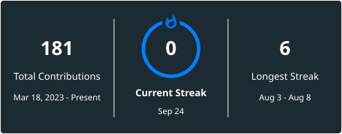

<div align="center">
  

  <h1>Krish Lakhani</h1>
  <h3>Full-Stack Developer | Cloud & DevOps | Competitive Programmer</h3>

  <p>
    <a href="https://codeforces.com/profile/KrisH_codes" target="_blank"></a>
    <a href="https://leetcode.com/u/_KRiSH_1/" target="_blank"></a>
    <a href="https://www.codechef.com/users/krish_codes_01" target="_blank"></a>
  </p>

  <p>
    <a href="https://www.krishlakhani.info/" target="_blank"></a>
    <a href="https://linkedin.com/in/krish-lakhani-" target="_blank"></a>
    <a href="mailto:work.krishlakhani@gmail.com"></a>
  </p>

  
</div>

---

## About Me

```javascript
const krish = {
  name: "Krish Lakhani",
  location: "Ahmedabad / Gandhinagar, India",
  education: "B.Tech, Computer Engineering, PDEU Gandhinagar (CGPA: 8.88/10)",
  experience: [
    "Software Engineer Intern @ Crest Data",
    "Software Development Intern @ (n)Code Solutions, GNFC IT Division",
    "Web Development Intern @ Rbian Infotech"
  ],
  interests: ["System Design", "Cloud Infrastructure", "RAG / LLM Applications", "Competitive Programming"],
  portfolio: "krishlakhani.info",
  currentlyExploring: "Backend systems, cloud-native architecture, and AI-powered developer tools",
  motto: "Engineering meaningful impact through code."
};
```

---

## Skills & Technologies

<div align="center">

### Languages


### Frameworks & Libraries


### Tools & Platforms


### Concepts


</div>

---

## Experience

**Software Engineer Intern**, Crest Data, Ahmedabad *(On-site)*
`Dec 2025 - July 2026`
- Built FastAPI-based integrations for Splunk, Datadog, and Dynatrace monitoring platforms
- Implemented ServiceNow and Zendesk integrations to streamline ticketing and service workflows

**Software Development Intern**, (n)Code Solutions, GNFC IT Division, Ahmedabad *(On-site)*
`June 2025 - August 2025`
- Developed secure full-stack applications using Node.js, Express.js, MongoDB, and AWS
- Applied system design, cloud deployment, and agile development practices

**Web Development Intern**, Rbian Infotech, Rajkot *(Remote)*
`May 2024 - July 2024`
- Built responsive websites with HTML, CSS, and JavaScript to enhance UI/UX and mobile access
- Collaborated with teams to add frontend features using clean, maintainable code

---

## Featured Projects

<div align="center">

| Project | Description | Tech | Link |
|:--------|:------------|:-----|:-----|
| **Episteme** | Chrome extension RAG pipeline that extracts an article's thesis via LLM, embeds it, and retrieves related articles via vector search to classify supports/contradicts/extends relationships | Chrome Extension (MV3) · Node.js · Supabase (pgvector) · LLM/RAG | [GitHub](https://github.com/Krisshhh/Episteme) |
| **Vaultify** | Secure, containerized file vault handling 500+ uploads with S3 integration, AES-256 encryption, JWT auth, CAPTCHA, and OTP verification | Node.js · Express.js · MongoDB · AWS S3/Lambda | [GitHub](https://github.com/Krisshhh/Vaultify) |
| **PoliStore** *(SIH'24)* | Full-stack AR-based hardware inventory portal for Madhya Pradesh Police with QR/AR tag tracking and JWT-secured login | MERN Stack · PostgreSQL · Unity · AR | [GitHub](https://github.com/Krisshhh/PoliStore) |
| **ChatSphere** | Real-time chat app supporting 100+ simultaneous users with JWT auth and MongoDB Atlas session management | Node.js · Express.js · MongoDB · Socket.IO | [GitHub](https://github.com/Krisshhh/ChatSphere-app) |

</div>

---

## Achievements

- **Finalist, Smart India Hackathon (SIH) 2024:** built a full-stack AR-based hardware inventory system for Madhya Pradesh Police (PSID: SIH 1789); ranked **Top 3 of 1000+ teams** nationally
- Completed **AWS Certified Cloud Practitioner** course (Udemy)
- Competitive Programming: **Codeforces 1412 (Specialist)** · **LeetCode 1721** · **CodeChef 1456**

---

## GitHub Stats

<div align="center">
  <a href="https://git.io/streak-stats"></a>
  <br/>
  
  <br/>
  
</div>

---

## Let's Connect

<div align="center">

**B.Tech Computer Engineering, PDEU · Open to Full-Time SDE Opportunities**

<a href="https://www.krishlakhani.info/" target="_blank"></a>
<a href="https://linkedin.com/in/krish-lakhani-" target="_blank"></a>
<a href="mailto:work.krishlakhani@gmail.com"></a>

</div>


